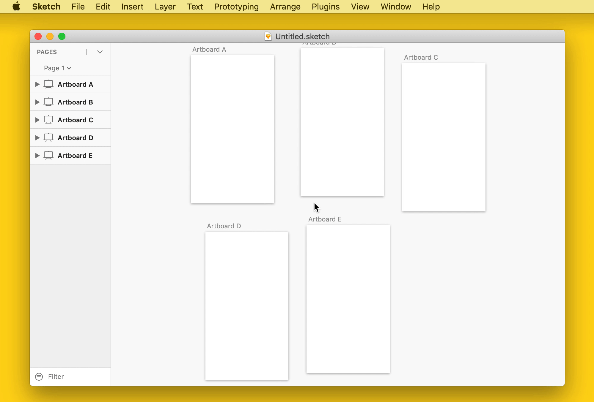

# Align to Grid 

> A Sketch plugin to align artboards and layers to a grid

## Commands

### Align Artboards to Canvas Grid

- Operates on artboards in the selection, or on all artboards on the current page if the selection is empty
- Can be configured to skip certain artboards based on a whitelist regular expression

Settings | Default
:--|:--
Grid width (pixels) | `200`
Grid height (pixels) | `200`
Whitelist regular expression | `^@`
Snap to canvas grid | `false`

### Align Layers to Artboard Grid

- Operates on layers in the selection, or on all layers within artboards on the current page if the selection is empty
- Can be configured to skip certain layers based on a whitelist regular expression

Settings | Default
:--|:--
Grid size (pixels) | `200`
Whitelist regular expression | `^@`
Snap to artboard grid | `false`

### Snap to Grid

- Enable `Snap to canvas grid` and `Snap to artboard grid` so that artboards/layers will snap to the canvas/artboard grid as they are moved

## Installation

1. [Download and unzip the latest release](https://github.com/yuanqing/sketch-plugins/releases/download/sketch-align-to-grid-0.1.1/plugin.zip)
2. Double-click `Align to Grid.sketchplugin` to install

## License

[MIT](LICENSE.md)
