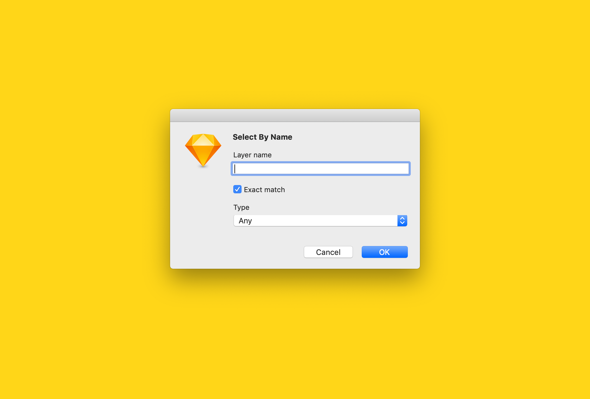

# Select Layers 

> A Sketch plugin to create or filter a selection of layers based on name, type or similarity

## Commands

### Select By Name

- Selects layers that match a given name or regular expression
- Filters the selected layers, or creates a new selection of layers if the selection is empty
- Can be configured to match one particular layer type

### Select By Type

- Selects layers of one particular type:
  - Artboard
  - Group
  - Shape Layer
  - Text Layer
  - Symbol Instance
  - Image
  - Slice
  - Hotspot
  - Hidden
- Filters the selected layers, or creates a new selection of layers if the selection is empty

### Select Same

- Selects layers with one particular attribute that is the same as the one selected layer:
  - Name
  - Layer Style or Text Style
  - Symbol Instance
- Exactly one layer must be selected before executing this command

## Installation

1. [Download and unzip the latest release](https://github.com/yuanqing/sketch-plugins/releases/download/sketch-select-layers-0.6.0/plugin.zip)
2. Double-click `Select Layers.sketchplugin` to install

## License

[MIT](LICENSE.md)
